# Revenue Intelligence Platform — Normalized Data Schema Reference

> **Domain:** Airline Revenue Management
> **Workspace:** Airline (IndiGo-style domestic India operations)
> **Stack:** PostgreSQL (operational OLTP) → Snowflake (analytical OLAP) → Next.js frontend
> **Schema version:** 2.0 — fully normalized
> **Last reviewed:** June 2026

---

## Normalization Principles Applied

This schema is designed to **3NF (Third Normal Form)** for OLTP tables and **Kimball dimensional modeling** for analytics.
Every decision below follows these rules:

| Rule | Rationale |
|---|---|
| No composite string PKs (e.g. `DEL-BOM`) | Cannot index, filter, or FK-enforce on sub-parts |
| No aggregates stored on dimensions | Aggregates go stale; always compute from facts |
| No formatted strings in DB (`"₹12.4M"`, `"4m 23s"`) | Store raw numbers; let the UI format |
| No pivot/wide tables for repeated measures | Use long format — every row is one observation |
| No UI concerns in DB (`color`, `icon`) | Colors belong in the frontend config, not the warehouse |
| No mutable user state mixed into analytical facts | Separate tables with `user_id` FK |
| No free-text discriminators (`"Manual override - ..."`) | Use enum/lookup dimension tables |
| Every table has an integer surrogate PK | Portable, index-friendly, decoupled from business keys |

---

## Layer 1 — Lookup / Reference Dimensions

Small, rarely-changing reference tables. Used as FK targets by all other tables.

---

### L1. `dim_airports`

**Source:** `src/data/airports.ts` | **Type:** `Airport`

| Column | Type | Nullable | Description |
|---|---|---|---|
| `airport_id` | `SMALLINT` | NOT NULL (PK, auto-increment) | Surrogate key |
| `iata_code` | `VARCHAR(3)` | NOT NULL (UNIQUE) | IATA airport code — e.g. `DEL`, `BOM` |
| `name` | `VARCHAR(255)` | NOT NULL | Full official airport name |
| `city` | `VARCHAR(100)` | NOT NULL | City served |
| `lat` | `DECIMAL(8,6)` | NOT NULL | Latitude |
| `lng` | `DECIMAL(9,6)` | NOT NULL | Longitude |
| `tier` | `SMALLINT` | NOT NULL | `1` = metro hub, `2` = major city, `3` = secondary city |

**Grain:** One row per airport.
**Current data:** 28 airports — 6 Tier 1, 7 Tier 2, 15 Tier 3.

> **Removed:** `revenue` — this was a denormalized aggregate. Compute it at query time:
> ```sql
> SELECT a.iata_code, SUM(b.revenue) AS total_revenue
> FROM fact_bookings b
> JOIN dim_airports a ON b.origin_airport_id = a.airport_id
> GROUP BY a.iata_code;
> ```

---

### L2. `dim_airlines`

**Source:** `src/lib/constants.ts`

| Column | Type | Nullable | Description |
|---|---|---|---|
| `airline_id` | `SMALLINT` | NOT NULL (PK, auto-increment) | Surrogate key |
| `iata_code` | `VARCHAR(3)` | NOT NULL (UNIQUE) | IATA carrier code — e.g. `6E`, `AI` |
| `name` | `VARCHAR(100)` | NOT NULL | Full airline name |

**Grain:** One row per airline.

> **Removed:** `color` — hex color is a UI display concern, not a data attribute. Map colors in the frontend config (`constants.ts`).
>
> **Removed:** `is_competitor` — this was a hardcoded single-operator assumption. `is_competitor = false` implicitly meant "we are IndiGo", which breaks the moment any other airline (Air India, Akasa, etc.) uses the platform — they would see themselves flagged as competitors. The airline dimension is now a **neutral registry** of all carriers. Who is "own" vs "competitor" is resolved at query time via `fact_tenant_airline_roles` (see L10), keyed by the logged-in tenant.

`dim_airlines` is now a clean, operator-agnostic registry:

| iata_code | name |
|---|---|
| 6E | IndiGo |
| AI | Air India |
| QP | Akasa Air |
| SG | SpiceJet |
| UK | Vistara |

---

### L3. `dim_aircraft_types`

**Source:** `src/lib/constants.ts`

| Column | Type | Nullable | Description |
|---|---|---|---|
| `aircraft_type_id` | `SMALLINT` | NOT NULL (PK, auto-increment) | Surrogate key |
| `type_code` | `VARCHAR(20)` | NOT NULL (UNIQUE) | Aircraft type string |
| `manufacturer` | `VARCHAR(50)` | NOT NULL | `Airbus` or `Boeing` or `ATR` |

**Grain:** One row per aircraft type.

> **Removed:** `capacity_economy`, `capacity_business` — these were a **wide/pivot anti-pattern** (same issue fixed in `fact_clv_monthly`). Adding Premium Economy or First class would have required a schema migration to add a new column. Per-class seat counts are now stored in `dim_aircraft_cabin_config` (see L4a) — one row per aircraft × cabin class. Aircraft that only operate two classes simply have two rows; the schema never needs to change when a new class is introduced.

| type_code | manufacturer |
|---|---|
| A320neo | Airbus |
| A321neo | Airbus |
| A320 | Airbus |
| ATR-72 | ATR |
| B737-800 | Boeing |
| B777-300ER | Boeing |

---

### L4. `dim_cabin_classes` *(new — was free VARCHAR)*

Normalizes `First`, `Business`, `Premium Economy`, `Economy` out of `fact_bookings`. All four industry-standard cabin classes are represented — actual seat availability per aircraft is resolved via `dim_aircraft_cabin_config` (L4a), not by columns here.

| Column | Type | Nullable | Description |
|---|---|---|---|
| `cabin_class_id` | `SMALLINT` | NOT NULL (PK, auto-increment) | Surrogate key |
| `class_code` | `VARCHAR(2)` | NOT NULL (UNIQUE) | `F` = First, `J` = Business, `W` = Premium Economy, `Y` = Economy |
| `class_name` | `VARCHAR(20)` | NOT NULL | Full display name |
| `fare_multiplier` | `DECIMAL(4,2)` | NOT NULL | Relative fare index vs Economy baseline |
| `sort_order` | `SMALLINT` | NOT NULL | Display order — `1` = First (front of cabin), `4` = Economy |

| class_code | class_name | fare_multiplier | sort_order |
|---|---|---|---|
| F | First | 5.00 | 1 |
| J | Business | 2.80 | 2 |
| W | Premium Economy | 1.80 | 3 |
| Y | Economy | 1.00 | 4 |

> **Added:** `F` (First) — required for wide-body operations (e.g. B777-300ER on Air India long-haul). Domestic narrowbody operators like IndiGo simply have no rows in `dim_aircraft_cabin_config` for `F` — no NULLs, no schema changes.
>
> **Added:** `sort_order` — without this, UI cabin ordering requires a `CASE` statement every time. An integer lets you `ORDER BY sort_order` natively.

---

### L4a. `dim_aircraft_cabin_config` *(new — replaces wide capacity pivot)*

One row per aircraft type × cabin class. Replaces the `capacity_economy` / `capacity_business` wide columns on `dim_aircraft_types`. A narrowbody with only Economy has one row here; a wide-body with First + Business + Economy has three rows. Adding a new cabin class is always just new rows — never a schema change.

| Column | Type | Nullable | Description |
|---|---|---|---|
| `config_id` | `SMALLINT` | NOT NULL (PK, auto-increment) | Surrogate key |
| `aircraft_type_id` | `SMALLINT` | NOT NULL (FK → `dim_aircraft_types.aircraft_type_id`) | Aircraft type |
| `cabin_class_id` | `SMALLINT` | NOT NULL (FK → `dim_cabin_classes.cabin_class_id`) | Cabin class offered |
| `seat_count` | `SMALLINT` | NOT NULL | Typical configured seat count for this class on this aircraft |

**Unique constraint:** `(aircraft_type_id, cabin_class_id)`
**Grain:** One row per aircraft type × cabin class.

**Realistic configuration data:**

| type_code | class_code | class_name | seat_count |
|---|---|---|---|
| A320neo | Y | Economy | 180 |
| A321neo | Y | Economy | 222 |
| A320 | Y | Economy | 162 |
| ATR-72 | Y | Economy | 70 |
| B737-800 | Y | Economy | 189 |
| B777-300ER | F | First | 8 |
| B777-300ER | J | Business | 35 |
| B777-300ER | Y | Economy | 245 |

> Note: IndiGo's A320neo/A321neo/A320 operate single-class Economy domestically. The B777-300ER (Air India) runs First + Business + Economy on long-haul. ATR-72 and B737-800 are Economy-only regionals. Premium Economy (`W`) is intentionally absent here — add rows when an operator configures it.

**Getting total capacity for an aircraft:**
```sql
SELECT at.type_code, SUM(c.seat_count) AS total_capacity
FROM dim_aircraft_cabin_config c
JOIN dim_aircraft_types at ON c.aircraft_type_id = at.aircraft_type_id
GROUP BY at.type_code;
```

**Checking if an aircraft offers a specific cabin class:**
```sql
-- Does the B777-300ER have a First class cabin?
SELECT EXISTS (
  SELECT 1
  FROM dim_aircraft_cabin_config c
  JOIN dim_aircraft_types at ON c.aircraft_type_id = at.aircraft_type_id
  JOIN dim_cabin_classes cc ON c.cabin_class_id = cc.cabin_class_id
  WHERE at.type_code = 'B777-300ER' AND cc.class_code = 'F'
) AS has_first_class;
```

---

### L5. `dim_loyalty_tiers` *(new — was free VARCHAR)*

Normalizes `Platinum`, `Gold`, `Silver`, `Bronze` out of `dim_customers`.

| Column | Type | Nullable | Description |
|---|---|---|---|
| `tier_id` | `SMALLINT` | NOT NULL (PK, auto-increment) | Surrogate key |
| `tier_name` | `VARCHAR(20)` | NOT NULL (UNIQUE) | `Platinum`, `Gold`, `Silver`, `Bronze` |
| `min_annual_spend` | `BIGINT` | NOT NULL | Minimum INR spend to qualify |
| `min_annual_flights` | `SMALLINT` | NOT NULL | Minimum flights per year to qualify |

| tier_name | min_annual_spend | min_annual_flights |
|---|---|---|
| Bronze | ₹0 | 0 |
| Silver | ₹50,000 | 4 |
| Gold | ₹2,00,000 | 12 |
| Platinum | ₹5,00,000 | 24 |

---

### L6. `dim_pipeline_definitions` *(new — separated from run log)*

Defines what each pipeline *is*, separate from its run history.

| Column | Type | Nullable | Description |
|---|---|---|---|
| `pipeline_def_id` | `SMALLINT` | NOT NULL (PK, auto-increment) | Surrogate key |
| `pipeline_name` | `VARCHAR(100)` | NOT NULL (UNIQUE) | Pipeline display name |
| `description` | `TEXT` | NULL | What the pipeline does |
| `schedule_cron` | `VARCHAR(50)` | NULL | Cron expression for scheduled runs |
| `is_active` | `BOOLEAN` | NOT NULL | Whether the pipeline is currently enabled |

| pipeline_name | schedule_cron |
|---|---|
| Booking Ingestion | `*/45 * * * *` |
| Forecast Generation | `0 2 * * *` |
| Competitor Pricing | `*/30 * * * *` |
| Customer Segmentation | `0 */2 * * *` |
| Revenue Reconciliation | `0 1 * * *` |

---

### L7. `dim_alert_categories` *(new — was free text)*

Normalizes the `action` / category string out of `fact_alerts`.

| Column | Type | Nullable | Description |
|---|---|---|---|
| `category_id` | `SMALLINT` | NOT NULL (PK, auto-increment) | Surrogate key |
| `category_code` | `VARCHAR(30)` | NOT NULL (UNIQUE) | Machine-readable slug |
| `category_name` | `VARCHAR(100)` | NOT NULL | Display name |

| category_code | category_name |
|---|---|
| `revenue_anomaly` | Revenue Anomaly |
| `competitor_pricing` | Competitor Pricing |
| `demand_spike` | Demand Spike |
| `load_factor_breach` | Load Factor Breach |
| `booking_surge` | Booking Surge |
| `model_retrain` | Model Retrain |
| `pipeline_failure` | Pipeline Failure |
| `maintenance_window` | Maintenance Window |
| `target_achieved` | Revenue Target Achieved |
| `segmentation_update` | Segmentation Update |

---

### L8. `dim_pricing_action_types` *(new — was free text blob)*

Normalizes the `action` column out of `fact_pricing_decisions`.

| Column | Type | Nullable | Description |
|---|---|---|---|
| `action_type_id` | `SMALLINT` | NOT NULL (PK, auto-increment) | Surrogate key |
| `action_code` | `VARCHAR(30)` | NOT NULL (UNIQUE) | Machine-readable slug |
| `action_name` | `VARCHAR(100)` | NOT NULL | Display label |
| `is_ai_driven` | `BOOLEAN` | NOT NULL | Whether action was AI-initiated |

| action_code | action_name | is_ai_driven |
|---|---|---|
| `ai_recommendation` | Applied AI Recommendation | true |
| `manual_competitive` | Manual Override — Competitive Response | false |
| `manual_promotional` | Manual Override — Promotional Pricing | false |
| `manual_other` | Manual Override — Other | false |

---

### L9. `dim_tenants` *(new — replaces hardcoded `is_competitor` assumption)*

One row per operator organisation using the platform. Enables full multi-tenancy: IndiGo, Air India, Akasa — each gets their own isolated view of who is "own" vs "competitor".

| Column | Type | Nullable | Description |
|---|---|---|---|
| `tenant_id` | `SMALLINT` | NOT NULL (PK, auto-increment) | Surrogate key |
| `iata_code` | `VARCHAR(3)` | NOT NULL (FK → `dim_airlines.iata_code`) | The airline that is the operator for this tenant |
| `tenant_name` | `VARCHAR(100)` | NOT NULL | Display name — e.g. `IndiGo Revenue Intelligence` |
| `is_active` | `BOOLEAN` | NOT NULL | Whether this tenant's account is live |
| `onboarded_at` | `DATE` | NOT NULL | Date tenant was activated |

**Grain:** One row per operator tenant.

| tenant_id | iata_code | tenant_name |
|---|---|---|
| 1 | 6E | IndiGo Revenue Intelligence |
| *(2 when Air India onboards)* | AI | Air India Revenue Intelligence |

---

### L10. `fact_tenant_airline_roles` *(new — junction, replaces `is_competitor`)*

Resolves the relationship between a tenant (the platform operator) and every airline in the registry. **Role is always relative to the tenant** — Air India is `own` for Air India's tenant row, and `competitor` for IndiGo's tenant row. No data migration needed when a new airline onboards.

| Column | Type | Nullable | Description |
|---|---|---|---|
| `role_pk` | `SMALLINT` | NOT NULL (PK, auto-increment) | Surrogate key |
| `tenant_id` | `SMALLINT` | NOT NULL (FK → `dim_tenants.tenant_id`) | The platform operator |
| `airline_id` | `SMALLINT` | NOT NULL (FK → `dim_airlines.airline_id`) | The airline being classified |
| `role` | `VARCHAR(15)` | NOT NULL | `own`, `competitor`, or `codeshare` |
| `effective_from` | `DATE` | NOT NULL | When this classification became active |
| `effective_to` | `DATE` | NULL | NULL = currently active |

**Unique constraint:** `(tenant_id, airline_id, effective_from)`
**Grain:** One row per tenant × airline × effective period.

> **Why not just a boolean?** `own`/`competitor`/`codeshare` covers real-world relationships (e.g. IndiGo has codeshare agreements). A boolean can't express that.

**Example — IndiGo as operator (tenant_id = 1):**

| tenant_id | airline_id | iata_code | role |
|---|---|---|---|
| 1 | 1 | 6E | own |
| 1 | 2 | AI | competitor |
| 1 | 3 | QP | competitor |
| 1 | 4 | SG | competitor |
| 1 | 5 | UK | competitor |

**Example — Air India as operator (tenant_id = 2), when onboarded:**

| tenant_id | airline_id | iata_code | role |
|---|---|---|---|
| 2 | 2 | AI | own |
| 2 | 1 | 6E | competitor |
| 2 | 3 | QP | competitor |
| 2 | 4 | SG | competitor |
| 2 | 5 | UK | competitor |

**Filtering competitor prices for the logged-in tenant:**

```sql
-- Get competitor fares for the current tenant (e.g. tenant_id = 1)
SELECT a.name AS competitor, r.route_label, cp.fare, cp.scraped_at
FROM fact_competitor_prices cp
JOIN dim_airlines a ON cp.airline_id = a.airline_id
JOIN dim_routes r ON cp.route_id = r.route_id
JOIN fact_tenant_airline_roles tar
  ON tar.airline_id = cp.airline_id
 AND tar.tenant_id = :current_tenant_id
 AND tar.role = 'competitor'
 AND tar.effective_to IS NULL
ORDER BY cp.scraped_at DESC;
```

> **Zero code change when Air India onboards** — just insert new rows into `dim_tenants` and `fact_tenant_airline_roles`. No schema migration, no boolean flipping, no data patches.

---

## Layer 2 — Core Dimensional Model

---

### D1. `dim_routes`

**Source:** `src/data/routes.ts` | **Type:** `RouteData`

Origin and destination are **separate FK columns** — never concatenated. `route_label` is a display-only derived attribute, never a join key.

| Column | Type | Nullable | Description |
|---|---|---|---|
| `route_id` | `INTEGER` | NOT NULL (PK, auto-increment) | Surrogate key |
| `origin_airport_id` | `SMALLINT` | NOT NULL (FK → `dim_airports.airport_id`) | Origin airport — joins to get code, city, tier |
| `destination_airport_id` | `SMALLINT` | NOT NULL (FK → `dim_airports.airport_id`) | Destination airport — same |
| `route_label` | `VARCHAR(7)` | GENERATED ALWAYS AS (`origin_code \|\| '-' \|\| dest_code`) | Display-only. **Never join on this.** |
| `distance_km` | `SMALLINT` | NULL | Great-circle distance in km |
| `is_active` | `BOOLEAN` | NOT NULL DEFAULT true | Whether route is operational |
| `launched_date` | `DATE` | NULL | Date route started operations |

**Grain:** One row per unique O&D pair.
**Unique constraint:** `(origin_airport_id, destination_airport_id)`

> **Pattern for all queries — always filter on individual FK columns:**
> ```sql
> -- All DEL departures
> WHERE r.origin_airport_id = (SELECT airport_id FROM dim_airports WHERE iata_code = 'DEL')
>
> -- Specific DEL → BOM route
> WHERE r.origin_airport_id = <DEL_id> AND r.destination_airport_id = <BOM_id>
>
> -- All routes touching BOM (origin OR destination)
> WHERE r.origin_airport_id = <BOM_id> OR r.destination_airport_id = <BOM_id>
> ```

---

### D2. `dim_customer_segments`

**Source:** `src/data/segments.ts` | **Type:** `CustomerSegment`

Fixed business-defined segment taxonomy — **not** a KMeans/ML pipeline output. These 5 segments are stable, human-readable labels assigned to customers based on behavioral rules. Segment definitions do not change per model run; they are the authoritative vocabulary of the platform.

| Column | Type | Nullable | Description |
|---|---|---|---|
| `segment_id` | `SMALLINT` | NOT NULL (PK, auto-increment) | Surrogate key |
| `segment_code` | `VARCHAR(30)` | NOT NULL (UNIQUE) | Machine-readable slug |
| `segment_name` | `VARCHAR(100)` | NOT NULL | Display name |
| `description` | `TEXT` | NULL | Behavioral description |

**Grain:** One row per segment. This is a static lookup — **5 rows, never changes shape**.

| segment_id | segment_code | segment_name |
|---|---|---|
| 1 | `business_travelers` | Business Travelers |
| 2 | `family_vacationers` | Family Vacationers |
| 3 | `budget_flyers` | Budget Flyers |
| 4 | `premium_leisure` | Premium Leisure |
| 5 | `frequent_commuters` | Frequent Commuters |

> **Removed:** `cluster_run_id` — was tied to KMeans pipeline runs. Segmentation is now a static business definition, not an ML artifact. If ML-driven re-segmentation is added later, it belongs in a separate `fact_segmentation_runs` table, not on this dimension.
>
> **Removed:** `effective_from`, `effective_to` (SCD Type 2) — SCD-2 is only needed when the *definition* of a segment can change over time. Since these are fixed business labels, version history is unnecessary. Customer-to-segment assignment history is tracked on `dim_customers.segment_assigned_at`.
>
> **Removed:** `count`, `percentage`, `avg_revenue`, `avg_bookings`, `retention`, `color`
>
> - Aggregates — compute at query time:
>   ```sql
>   SELECT s.segment_name,
>          COUNT(c.customer_id)           AS customer_count,
>          ROUND(AVG(b.revenue_ytd), 2)   AS avg_revenue
>   FROM dim_customers c
>   JOIN dim_customer_segments s ON c.segment_id = s.segment_id
>   LEFT JOIN (...) b ON c.customer_id = b.customer_id
>   GROUP BY s.segment_name;
>   ```
> - `color` — UI config, not a database attribute.

---

### D3. `dim_customers`

**Source:** `src/data/segments.ts` | **Type:** `Customer`

| Column | Type | Nullable | Description |
|---|---|---|---|
| `customer_id` | `INTEGER` | NOT NULL (PK, auto-increment) | Surrogate key |
| `external_id` | `VARCHAR(20)` | NOT NULL (UNIQUE) | Business key from POS system |
| `full_name` | `VARCHAR(255)` | NOT NULL | Customer display name |
| `segment_id` | `SMALLINT` | NOT NULL (FK → `dim_customer_segments.segment_id`) | Current segment assignment |
| `loyalty_tier_id` | `SMALLINT` | NOT NULL (FK → `dim_loyalty_tiers.tier_id`) | Current loyalty tier |
| `email` | `VARCHAR(255)` | NULL | Contact email |
| `phone` | `VARCHAR(20)` | NULL | Contact phone |
| `first_booking_date` | `DATE` | NULL | Date of first ever booking |
| `segment_assigned_at` | `TIMESTAMPTZ` | NOT NULL | When last segment assignment was made |

> **Removed:** `total_revenue`, `bookings`, `ltv`, `last_booking`
>
> These are **aggregates and derived values** — they get stale the moment a new booking is made. Compute them from `fact_bookings`:
> ```sql
> SELECT
>     c.customer_id,
>     SUM(b.revenue)                      AS total_revenue,
>     COUNT(b.booking_pk)                 AS total_bookings,
>     MAX(b.travel_date)                  AS last_booking_date
> FROM dim_customers c
> LEFT JOIN fact_bookings b ON c.customer_id = b.customer_id
> GROUP BY c.customer_id;
> ```
> LTV is a model output — store in `fact_customer_ltv_scores`, not on the customer dim.

---

## Layer 3 — Fact Tables

---

### F1. `fact_bookings` *(core transactional fact)*

**Source:** `src/data/explorer.ts` | **Type:** `BookingRecord`

Every booking is one row. Origin and destination stored as **two separate indexed FK columns** — never parsed from a string.

| Column | Type | Nullable | Description |
|---|---|---|---|
| `booking_pk` | `BIGINT` | NOT NULL (PK, auto-increment) | Surrogate key |
| `booking_id` | `VARCHAR(10)` | NOT NULL (UNIQUE) | Business booking reference — e.g. `6E-4821` |
| `customer_id` | `INTEGER` | NULL (FK → `dim_customers.customer_id`) | Customer who booked (NULL if anonymous/walk-in) |
| `route_id` | `INTEGER` | NOT NULL (FK → `dim_routes.route_id`) | Route FK |
| `origin_airport_id` | `SMALLINT` | NOT NULL (FK → `dim_airports.airport_id`) | Origin — redundant for fast filtering without a join |
| `destination_airport_id` | `SMALLINT` | NOT NULL (FK → `dim_airports.airport_id`) | Destination — same rationale |
| `airline_id` | `SMALLINT` | NOT NULL (FK → `dim_airlines.airline_id`) | Operating carrier |
| `aircraft_type_id` | `SMALLINT` | NOT NULL (FK → `dim_aircraft_types.aircraft_type_id`) | Aircraft flown |
| `cabin_class_id` | `SMALLINT` | NOT NULL (FK → `dim_cabin_classes.cabin_class_id`) | Cabin class |
| `fare` | `DECIMAL(10,2)` | NOT NULL | Per-passenger base fare (INR) |
| `passengers` | `SMALLINT` | NOT NULL | Passenger count |
| `revenue` | `DECIMAL(12,2)` | GENERATED AS (`fare * passengers`) | Total booking revenue (INR) — computed column |
| `load_factor_pct` | `DECIMAL(5,2)` | NOT NULL | Flight load factor at time of booking (0–100) |
| `travel_date` | `DATE` | NOT NULL | Departure/travel date |
| `booking_date` | `DATE` | NULL | Date booking was made (enables advance-purchase analysis) |
| `created_at` | `TIMESTAMPTZ` | NOT NULL DEFAULT now() | Record insert timestamp |

**Grain:** One row per booking transaction.
**Current data:** 500 synthetic records, last 90 days, 20 routes.

**Indexes:**
```sql
CREATE INDEX idx_fb_origin      ON fact_bookings (origin_airport_id);
CREATE INDEX idx_fb_destination ON fact_bookings (destination_airport_id);
CREATE INDEX idx_fb_route       ON fact_bookings (route_id);
CREATE INDEX idx_fb_customer    ON fact_bookings (customer_id);
CREATE INDEX idx_fb_travel_date ON fact_bookings (travel_date);
CREATE INDEX idx_fb_od_date     ON fact_bookings (origin_airport_id, destination_airport_id, travel_date);
```

---

### F2. `fact_route_daily_snapshot` *(new — replaces aggregates on dim_routes)*

Replaces the denormalized `revenue/bookings/occupancy/avg_fare` that were on `dim_routes`. Pre-aggregated daily roll-up, either materialized or written by the Booking Ingestion pipeline.

| Column | Type | Nullable | Description |
|---|---|---|---|
| `snapshot_pk` | `BIGINT` | NOT NULL (PK, auto-increment) | Surrogate key |
| `route_id` | `INTEGER` | NOT NULL (FK → `dim_routes.route_id`) | Route |
| `origin_airport_id` | `SMALLINT` | NOT NULL (FK → `dim_airports.airport_id`) | Origin — for fast independent filtering |
| `destination_airport_id` | `SMALLINT` | NOT NULL (FK → `dim_airports.airport_id`) | Destination |
| `snapshot_date` | `DATE` | NOT NULL | Date of this snapshot |
| `total_revenue` | `DECIMAL(14,2)` | NOT NULL | Total revenue on this route on this date (INR) |
| `total_bookings` | `INTEGER` | NOT NULL | Total bookings |
| `total_passengers` | `INTEGER` | NOT NULL | Total passengers |
| `avg_fare` | `DECIMAL(10,2)` | NOT NULL | Average per-passenger fare (INR) |
| `avg_load_factor_pct` | `DECIMAL(5,2)` | NOT NULL | Average load factor % |
| `avg_occupancy_pct` | `DECIMAL(5,2)` | NOT NULL | Average occupancy % |
| `competitor_gap_inr` | `DECIMAL(10,2)` | NULL | Our avg fare minus cheapest competitor fare |

**Grain:** One row per route per day.
**Unique constraint:** `(route_id, snapshot_date)`

---

### F3. `fact_competitor_prices`

**Source:** `src/data/routes.ts` | **Type:** `CompetitorPrice`

| Column | Type | Nullable | Description |
|---|---|---|---|
| `price_pk` | `BIGINT` | NOT NULL (PK, auto-increment) | Surrogate key |
| `scrape_run_id` | `VARCHAR(36)` | NOT NULL | UUID grouping all rows from one scrape batch |
| `route_id` | `INTEGER` | NOT NULL (FK → `dim_routes.route_id`) | Route FK |
| `origin_airport_id` | `SMALLINT` | NOT NULL (FK → `dim_airports.airport_id`) | Origin — fast filter |
| `destination_airport_id` | `SMALLINT` | NOT NULL (FK → `dim_airports.airport_id`) | Destination — fast filter |
| `airline_id` | `SMALLINT` | NOT NULL (FK → `dim_airlines.airline_id`) | Competitor airline |
| `fare` | `DECIMAL(10,2)` | NOT NULL | Competitor's listed fare (INR) |
| `pct_change_from_prev` | `DECIMAL(5,2)` | NULL | % change vs previous scrape for same route+airline |
| `scraped_at` | `TIMESTAMPTZ` | NOT NULL | Timestamp of data capture |

**Grain:** One row per airline × route × scrape run.
**Update cadence:** Every 30 minutes (Pipeline `p3`).

---

### F4. `fact_revenue_daily` *(replaces polymorphic `fact_revenue_timeseries`)*

The old `fact_revenue_timeseries` was polymorphic — same shape used for revenue, bookings, occupancy, and fares. This is replaced by a **named, typed table** so the query engine can index properly.

| Column | Type | Nullable | Description |
|---|---|---|---|
| `daily_pk` | `BIGINT` | NOT NULL (PK, auto-increment) | Surrogate key |
| `route_id` | `INTEGER` | NULL (FK → `dim_routes.route_id`) | Route — NULL means network-level aggregate |
| `origin_airport_id` | `SMALLINT` | NULL (FK → `dim_airports.airport_id`) | Origin airport — NULL for network-level |
| `destination_airport_id` | `SMALLINT` | NULL (FK → `dim_airports.airport_id`) | Destination airport |
| `metric_date` | `DATE` | NOT NULL | Date of observation |
| `revenue_inr` | `DECIMAL(14,2)` | NULL | Total revenue (INR) |
| `bookings_count` | `INTEGER` | NULL | Booking count |
| `avg_fare_inr` | `DECIMAL(10,2)` | NULL | Average fare (INR) |
| `avg_occupancy_pct` | `DECIMAL(5,2)` | NULL | Occupancy % |
| `avg_load_factor_pct` | `DECIMAL(5,2)` | NULL | Load factor % |
| `is_actual` | `BOOLEAN` | NOT NULL | `true` = observed, `false` = forecast |
| `forecast_run_id` | `VARCHAR(36)` | NULL | FK to `fact_forecast_runs.run_id` — populated for forecast rows |
| `upper_bound` | `DECIMAL(14,2)` | NULL | Confidence interval upper bound (forecast rows only) |
| `lower_bound` | `DECIMAL(14,2)` | NULL | Confidence interval lower bound (forecast rows only) |

**Grain:** One row per (route or network) per date per actual/forecast.

> **Why not separate actual and forecast tables?**
> Keeping them together with `is_actual` lets you do "actuals vs forecast" comparisons with a single self-join on `metric_date`. The `forecast_run_id` stays NULL for actual rows, so there's no confusion.

---

### F5. `fact_forecast_runs` *(new — replaces single `fact_forecast_output`)*

Each model training run produces one row here, plus many rows in `fact_revenue_daily` (with `is_actual = false`).

| Column | Type | Nullable | Description |
|---|---|---|---|
| `run_id` | `VARCHAR(36)` | NOT NULL (PK) | UUID assigned at training time |
| `route_id` | `INTEGER` | NULL (FK → `dim_routes.route_id`) | Route scope — NULL = all routes |
| `origin_airport_id` | `SMALLINT` | NULL (FK → `dim_airports.airport_id`) | Origin airport scope |
| `destination_airport_id` | `SMALLINT` | NULL (FK → `dim_airports.airport_id`) | Destination airport scope |
| `model_name` | `VARCHAR(50)` | NOT NULL | e.g. `Prophet`, `XGBoost`, `Ensemble` |
| `horizon_days` | `SMALLINT` | NOT NULL | Forecast horizon: `7`, `30`, or `90` |
| `trained_at` | `TIMESTAMPTZ` | NOT NULL | When the model was trained |
| `training_data_from` | `DATE` | NOT NULL | Start of training window |
| `training_data_to` | `DATE` | NOT NULL | End of training window |
| `accuracy_pct` | `DECIMAL(5,2)` | NOT NULL | Overall accuracy % |
| `mae` | `DECIMAL(8,4)` | NOT NULL | Mean Absolute Error |
| `rmse` | `DECIMAL(8,4)` | NOT NULL | Root Mean Square Error |
| `mape` | `DECIMAL(5,2)` | NOT NULL | Mean Absolute Percentage Error % |
| `is_deployed` | `BOOLEAN` | NOT NULL | Whether this run is the current production model |

**Grain:** One row per model training run.

> **Current model performance by horizon:**
>
> | Horizon | Model | Accuracy | MAE | RMSE | MAPE |
> |---|---|---|---|---|---|
> | 7 days | Ensemble | 96.2% | 12.4 | 18.7 | 3.8% |
> | 30 days | Ensemble | 94.1% | 18.2 | 24.5 | 5.9% |
> | 90 days | Ensemble | 89.7% | 28.6 | 35.2 | 10.3% |

---

### F6. `fact_alerts`

**Source:** `src/data/alerts.ts` | **Type:** `Alert`

| Column | Type | Nullable | Description |
|---|---|---|---|
| `alert_id` | `INTEGER` | NOT NULL (PK, auto-increment) | Surrogate key |
| `category_id` | `SMALLINT` | NOT NULL (FK → `dim_alert_categories.category_id`) | Alert category |
| `severity` | `SMALLINT` | NOT NULL | `1` = info, `2` = warning, `3` = critical |
| `title` | `VARCHAR(255)` | NOT NULL | Alert headline |
| `description` | `TEXT` | NOT NULL | Detail with context and recommended action |
| `route_id` | `INTEGER` | NULL (FK → `dim_routes.route_id`) | Affected route (NULL = system-level) |
| `origin_airport_id` | `SMALLINT` | NULL (FK → `dim_airports.airport_id`) | Affected origin (NULL = system-level) |
| `destination_airport_id` | `SMALLINT` | NULL (FK → `dim_airports.airport_id`) | Affected destination |
| `pipeline_run_id` | `INTEGER` | NULL (FK → `fact_pipeline_runs.run_id`) | Source pipeline run if alert was triggered by a pipeline |
| `created_at` | `TIMESTAMPTZ` | NOT NULL | Alert generation timestamp |

> **Removed:** `is_read` — this is **mutable per-user state**, not an analytical attribute. It belongs in `user_alert_reads`.

**Grain:** One row per alert event.

---

### F6a. `user_alert_reads` *(new — separated from `fact_alerts`)*

Tracks which users have read which alerts. One user reading an alert must not affect another user's view.

| Column | Type | Nullable | Description |
|---|---|---|---|
| `read_pk` | `BIGINT` | NOT NULL (PK, auto-increment) | Surrogate key |
| `alert_id` | `INTEGER` | NOT NULL (FK → `fact_alerts.alert_id`) | Alert that was read |
| `user_id` | `INTEGER` | NOT NULL (FK → `users.user_id`) | User who read it |
| `read_at` | `TIMESTAMPTZ` | NOT NULL | When the alert was marked read |

**Unique constraint:** `(alert_id, user_id)`

---

### F7. `fact_pipeline_runs`

**Source:** `src/data/pipeline.ts` | **Type:** `Pipeline`

One row per pipeline execution. Pipeline *definition* lives in `dim_pipeline_definitions`.

| Column | Type | Nullable | Description |
|---|---|---|---|
| `run_id` | `INTEGER` | NOT NULL (PK, auto-increment) | Surrogate key |
| `pipeline_def_id` | `SMALLINT` | NOT NULL (FK → `dim_pipeline_definitions.pipeline_def_id`) | Which pipeline ran |
| `status` | `VARCHAR(10)` | NOT NULL | `success`, `running`, `failed`, `scheduled` |
| `started_at` | `TIMESTAMPTZ` | NOT NULL | Run start timestamp |
| `finished_at` | `TIMESTAMPTZ` | NULL | Run end timestamp (NULL if still running) |
| `duration_seconds` | `INTEGER` | GENERATED AS (`EXTRACT(EPOCH FROM (finished_at - started_at))`) | Duration in seconds — computed, not stored as `"4m 23s"` |
| `error_message` | `TEXT` | NULL | Error detail if status = `failed` |
| `triggered_by` | `VARCHAR(20)` | NOT NULL | `scheduler`, `manual`, `api` |

> **Removed:** `duration VARCHAR` (was `"4m 23s"`) — you cannot `SUM`, `AVG`, or compare human-readable strings. Store seconds, format in the UI:
> ```sql
> -- Average run duration in minutes
> SELECT AVG(duration_seconds) / 60.0 AS avg_minutes
> FROM fact_pipeline_runs
> WHERE pipeline_def_id = 1;
> ```

---

### F7a. `fact_pipeline_task_runs`

**Source:** `src/data/pipeline.ts` | **Type:** `PipelineTask`

One row per task within a pipeline run. DAG edges (dependencies) stored in a separate junction table.

| Column | Type | Nullable | Description |
|---|---|---|---|
| `task_run_id` | `INTEGER` | NOT NULL (PK, auto-increment) | Surrogate key |
| `pipeline_run_id` | `INTEGER` | NOT NULL (FK → `fact_pipeline_runs.run_id`) | Parent run |
| `task_name` | `VARCHAR(100)` | NOT NULL | Task display name |
| `task_order` | `SMALLINT` | NOT NULL | Execution order index within the pipeline |
| `status` | `VARCHAR(10)` | NOT NULL | `success`, `running`, `failed`, `pending` |
| `started_at` | `TIMESTAMPTZ` | NULL | Task start timestamp |
| `finished_at` | `TIMESTAMPTZ` | NULL | Task end timestamp |
| `duration_seconds` | `INTEGER` | GENERATED AS (`EXTRACT(EPOCH FROM (finished_at - started_at))`) | Duration in seconds |
| `error_message` | `TEXT` | NULL | Error detail if status = `failed` |

---

### F7b. `fact_pipeline_task_dependencies` *(new — was `VARCHAR[]`)*

Junction table for task-level DAG edges. Replaces the `dependencies: string[]` array column.

| Column | Type | Nullable | Description |
|---|---|---|---|
| `task_run_id` | `INTEGER` | NOT NULL (FK → `fact_pipeline_task_runs.task_run_id`) | Downstream task |
| `depends_on_task_run_id` | `INTEGER` | NOT NULL (FK → `fact_pipeline_task_runs.task_run_id`) | Upstream task (must complete first) |

**PK:** `(task_run_id, depends_on_task_run_id)`

> **Why not `VARCHAR[]`?** Arrays are opaque to the query planner — you can't index them or join on them. A junction table lets you traverse the DAG with standard SQL:
> ```sql
> -- All tasks that must complete before task 42
> SELECT t.task_name
> FROM fact_pipeline_task_dependencies d
> JOIN fact_pipeline_task_runs t ON t.task_run_id = d.depends_on_task_run_id
> WHERE d.task_run_id = 42;
> ```

---

### F8. `fact_pricing_simulations`

**Source:** `src/data/pricing.ts`

| Column | Type | Nullable | Description |
|---|---|---|---|
| `simulation_pk` | `BIGINT` | NOT NULL (PK, auto-increment) | Surrogate key |
| `simulation_run_id` | `VARCHAR(36)` | NOT NULL | UUID grouping all rows for one simulation run |
| `route_id` | `INTEGER` | NOT NULL (FK → `dim_routes.route_id`) | Route this simulation applies to |
| `origin_airport_id` | `SMALLINT` | NOT NULL (FK → `dim_airports.airport_id`) | Origin — fast filter |
| `destination_airport_id` | `SMALLINT` | NOT NULL (FK → `dim_airports.airport_id`) | Destination |
| `simulated_fare` | `DECIMAL(10,2)` | NOT NULL | Simulated fare point (INR) |
| `expected_revenue` | `DECIMAL(14,2)` | NOT NULL | Expected revenue at this fare |
| `expected_bookings` | `INTEGER` | NOT NULL | Expected booking volume |
| `expected_load_factor_pct` | `DECIMAL(5,2)` | NOT NULL | Expected load factor % |
| `is_recommended` | `BOOLEAN` | NOT NULL | `true` for the revenue-maximizing fare point |
| `simulated_at` | `TIMESTAMPTZ` | NOT NULL | When simulation was generated |

**Grain:** One row per fare point per simulation run per route.

> **Old design flaw fixed:** The old table had `fare` as PK with no `route_id` or `simulation_run_id`. That meant you could only store one simulation globally and it was impossible to compare simulations over time or across routes.

---

### F9. `fact_pricing_decisions`

**Source:** `src/data/pricing.ts`

Audit log of all fare changes. Every column is now typed — no free text blobs.

| Column | Type | Nullable | Description |
|---|---|---|---|
| `decision_pk` | `INTEGER` | NOT NULL (PK, auto-increment) | Surrogate key |
| `route_id` | `INTEGER` | NOT NULL (FK → `dim_routes.route_id`) | Route FK |
| `origin_airport_id` | `SMALLINT` | NOT NULL (FK → `dim_airports.airport_id`) | Origin — fast filter |
| `destination_airport_id` | `SMALLINT` | NOT NULL (FK → `dim_airports.airport_id`) | Destination |
| `action_type_id` | `SMALLINT` | NOT NULL (FK → `dim_pricing_action_types.action_type_id`) | Type of pricing action |
| `previous_fare` | `DECIMAL(10,2)` | NOT NULL | Fare before change (INR) |
| `new_fare` | `DECIMAL(10,2)` | NOT NULL | Fare after change (INR) |
| `fare_delta` | `DECIMAL(10,2)` | GENERATED AS (`new_fare - previous_fare`) | Absolute change (INR) |
| `fare_delta_pct` | `DECIMAL(5,2)` | GENERATED AS (`((new_fare - previous_fare) / previous_fare) * 100`) | % change |
| `revenue_impact_pct` | `DECIMAL(5,2)` | NULL | Observed revenue impact % (backfilled after measurement window) |
| `decided_at` | `TIMESTAMPTZ` | NOT NULL | When decision was applied |
| `decided_by_user_id` | `INTEGER` | NULL (FK → `users.user_id`) | User who made manual override (NULL for AI) |
| `simulation_run_id` | `VARCHAR(36)` | NULL | Source simulation that drove this decision |
| `notes` | `TEXT` | NULL | Free-text notes for manual overrides |

> **Removed:** `impact VARCHAR` (was `"+5.2% revenue"`) — storing formatted strings prevents any arithmetic. Store the raw decimal; the UI formats it.

**Grain:** One row per pricing decision.

---

### F10. `fact_clv_monthly` *(long format — replaces wide pivot)*

**Source:** `src/data/segments.ts`

The old `fact_clv_trend` had `premium`, `frequent`, `budget` as separate columns — a pivot table. This is the normalized long format.

| Column | Type | Nullable | Description |
|---|---|---|---|
| `clv_pk` | `INTEGER` | NOT NULL (PK, auto-increment) | Surrogate key |
| `segment_id` | `SMALLINT` | NOT NULL (FK → `dim_customer_segments.segment_id`) | Customer segment |
| `month_year` | `DATE` | NOT NULL | First day of the month (e.g. `2025-01-01`) |
| `avg_clv_inr` | `DECIMAL(12,2)` | NOT NULL | Average CLV for this segment this month (INR) |

**Grain:** One row per segment per month.
**Unique constraint:** `(segment_id, month_year)`

> **Old design flaw fixed:** Wide pivot format (`premium`, `frequent`, `budget` columns) breaks the moment you add a 4th segment — you'd need a schema migration. Long format means adding a new segment is just new rows.
>
> ```sql
> -- Pivot back to wide in SQL when needed for a chart
> SELECT month_year,
>        MAX(CASE WHEN s.segment_code = 'premium' THEN avg_clv_inr END) AS premium,
>        MAX(CASE WHEN s.segment_code = 'frequent' THEN avg_clv_inr END) AS frequent,
>        MAX(CASE WHEN s.segment_code = 'budget'  THEN avg_clv_inr END) AS budget
> FROM fact_clv_monthly f
> JOIN dim_customer_segments s ON f.segment_id = s.segment_id
> GROUP BY month_year ORDER BY month_year;
> ```

---

### F11. `fact_cohort_retention` *(long format — replaces sparse triangle)*

**Source:** `src/data/segments.ts`

The old sparse triangle had `month_1`...`month_6` columns. Normalized to long format.

| Column | Type | Nullable | Description |
|---|---|---|---|
| `retention_pk` | `INTEGER` | NOT NULL (PK, auto-increment) | Surrogate key |
| `cohort_month` | `DATE` | NOT NULL | First day of the acquisition cohort month |
| `month_offset` | `SMALLINT` | NOT NULL | Months since acquisition: `0` = acquisition month (always 100%), `1` = M+1, etc. |
| `retention_pct` | `DECIMAL(5,2)` | NOT NULL | Retention % at this offset |

**Grain:** One row per cohort × month offset.
**Unique constraint:** `(cohort_month, month_offset)`

> **Old design flaw fixed:** Sparse triangle (`month_1`...`month_6`) had NULL columns for cohorts that haven't matured yet, and required a schema migration to track month 7. Long format is append-only — new observations are just new rows.
>
> ```sql
> -- Cohort retention curve for Jan 2025
> SELECT month_offset, retention_pct
> FROM fact_cohort_retention
> WHERE cohort_month = '2025-01-01'
> ORDER BY month_offset;
> ```

---

### F12. `fact_hourly_revenue`

**Source:** `src/data/dashboard.ts`

| Column | Type | Nullable | Description |
|---|---|---|---|
| `hourly_pk` | `BIGINT` | NOT NULL (PK, auto-increment) | Surrogate key |
| `snapshot_date` | `DATE` | NOT NULL | The calendar date this hour belongs to |
| `hour_of_day` | `SMALLINT` | NOT NULL | Hour 0–23 (IST) |
| `route_id` | `INTEGER` | NULL (FK → `dim_routes.route_id`) | Route — NULL = network-level |
| `origin_airport_id` | `SMALLINT` | NULL (FK → `dim_airports.airport_id`) | Origin — NULL = network-level |
| `destination_airport_id` | `SMALLINT` | NULL (FK → `dim_airports.airport_id`) | Destination |
| `revenue_inr` | `DECIMAL(14,2)` | NOT NULL | Revenue in this hour (INR) |
| `booking_count` | `INTEGER` | NOT NULL | Bookings in this hour |

**Grain:** One row per date × hour × (route or network).
**Unique constraint:** `(snapshot_date, hour_of_day, route_id)` — `route_id` nullable so use `COALESCE`.

> **Old design flaw fixed:** The old table had only `hour` (0–23) with no `snapshot_date`. You couldn't tell *which day's* hourly distribution you were looking at, making time-based comparisons impossible.

---

### F13. `fact_weekly_performance`

**Source:** `src/data/routes.ts`

| Column | Type | Nullable | Description |
|---|---|---|---|
| `weekly_pk` | `INTEGER` | NOT NULL (PK, auto-increment) | Surrogate key |
| `route_id` | `INTEGER` | NOT NULL (FK → `dim_routes.route_id`) | Route FK |
| `origin_airport_id` | `SMALLINT` | NOT NULL (FK → `dim_airports.airport_id`) | Origin — fast filter |
| `destination_airport_id` | `SMALLINT` | NOT NULL (FK → `dim_airports.airport_id`) | Destination |
| `week_start_date` | `DATE` | NOT NULL | Monday of the ISO week (e.g. `2025-06-09`) |
| `week_end_date` | `DATE` | GENERATED AS (`week_start_date + 6`) | Sunday of the ISO week |
| `iso_week_number` | `SMALLINT` | NOT NULL | ISO week number (1–53) |
| `iso_year` | `SMALLINT` | NOT NULL | ISO week year |
| `total_revenue` | `DECIMAL(14,2)` | NOT NULL | Weekly revenue (INR) |
| `total_bookings` | `INTEGER` | NOT NULL | Weekly bookings count |
| `avg_occupancy_pct` | `DECIMAL(5,2)` | NOT NULL | Avg occupancy % |
| `avg_fare_inr` | `DECIMAL(10,2)` | NOT NULL | Avg fare (INR) |
| `avg_load_factor_pct` | `DECIMAL(5,2)` | NOT NULL | Avg load factor % |

**Grain:** One row per route per ISO week.

> **Old design flaw fixed:** `week VARCHAR` = `"Week 1"` is meaningless. You can't order, filter by date range, or calculate week-over-week delta without knowing the actual date. `week_start_date` is the proper anchor.

---

### F14. `fact_seasonality_indices`

**Source:** `src/data/forecasting.ts`

Merged `dim_dow_seasonality` and `dim_month_seasonality` into a single normalized table.

| Column | Type | Nullable | Description |
|---|---|---|---|
| `index_pk` | `SMALLINT` | NOT NULL (PK, auto-increment) | Surrogate key |
| `granularity` | `VARCHAR(10)` | NOT NULL | `dow` or `monthly` |
| `period_value` | `SMALLINT` | NOT NULL | For `dow`: 0 (Mon) – 6 (Sun). For `monthly`: 1 (Jan) – 12 (Dec) |
| `period_label` | `VARCHAR(10)` | NOT NULL | Display label — e.g. `Mon`, `Jan` |
| `demand_index` | `INTEGER` | NOT NULL | Relative demand index |

> **Old design flaw fixed:** `day VARCHAR(3)` and `month VARCHAR(3)` as keys meant you couldn't sort chronologically without a CASE statement. Integer `period_value` sorts natively.

---

### F15. `fact_customer_ltv_scores` *(new — separated from dim_customers)*

| Column | Type | Nullable | Description |
|---|---|---|---|
| `ltv_pk` | `INTEGER` | NOT NULL (PK, auto-increment) | Surrogate key |
| `customer_id` | `INTEGER` | NOT NULL (FK → `dim_customers.customer_id`) | Customer |
| `model_run_id` | `VARCHAR(36)` | NOT NULL | UUID of the LTV model run |
| `ltv_inr` | `BIGINT` | NOT NULL | Predicted Customer Lifetime Value (INR) |
| `confidence_score` | `DECIMAL(5,2)` | NULL | Model confidence (0–100) |
| `scored_at` | `TIMESTAMPTZ` | NOT NULL | When score was generated |
| `is_current` | `BOOLEAN` | NOT NULL | `true` for the latest active score |

**Grain:** One row per customer per model run.

---

### F16. `fact_kpi_snapshots` *(replaces `fact_kpi_snapshot`)*

**Source:** `src/data/dashboard.ts` | **Type:** `KPICard`

| Column | Type | Nullable | Description |
|---|---|---|---|
| `kpi_pk` | `INTEGER` | NOT NULL (PK, auto-increment) | Surrogate key |
| `kpi_code` | `VARCHAR(30)` | NOT NULL | Machine key: `revenue_today`, `bookings`, `load_factor`, etc. |
| `kpi_name` | `VARCHAR(100)` | NOT NULL | Display label |
| `numeric_value` | `DECIMAL(15,4)` | NOT NULL | **Raw numeric value** — format in the UI |
| `unit` | `VARCHAR(10)` | NOT NULL | `INR`, `count`, `pct` |
| `pct_change` | `DECIMAL(5,2)` | NOT NULL | % change vs comparison period |
| `comparison_period` | `VARCHAR(30)` | NOT NULL | `yesterday`, `last_week`, `last_month` |
| `trend_direction` | `SMALLINT` | NOT NULL | `1` = up, `-1` = down, `0` = neutral |
| `snapshotted_at` | `TIMESTAMPTZ` | NOT NULL | When this KPI row was captured |

> **Old design flaw fixed:** `value VARCHAR` = `"₹12.4M"` stored a formatted string — you cannot do arithmetic on that. Store `12400000` as `DECIMAL` and let the frontend format it as `"₹12.4M"`.

---

## Layer 4 — Application / Session Tables

---

### A1. `chat_conversations`

**Source:** `src/data/copilot.ts` | **Type:** `ChatConversation`

| Column | Type | Nullable | Description |
|---|---|---|---|
| `conversation_id` | `INTEGER` | NOT NULL (PK, auto-increment) | Surrogate key |
| `user_id` | `INTEGER` | NOT NULL (FK → `users.user_id`) | Owning user |
| `title` | `VARCHAR(255)` | NOT NULL | Auto-generated title |
| `created_at` | `TIMESTAMPTZ` | NOT NULL | Creation timestamp |
| `last_message_at` | `TIMESTAMPTZ` | NOT NULL | Timestamp of latest message (for ordering) |

---

### A2. `chat_messages`

**Source:** `src/data/copilot.ts` | **Type:** `ChatMessage`

| Column | Type | Nullable | Description |
|---|---|---|---|
| `message_id` | `INTEGER` | NOT NULL (PK, auto-increment) | Surrogate key |
| `conversation_id` | `INTEGER` | NOT NULL (FK → `chat_conversations.conversation_id`) | Parent conversation |
| `role` | `VARCHAR(10)` | NOT NULL | `user` or `assistant` |
| `content` | `TEXT` | NOT NULL | Message body (Markdown) |
| `generated_sql` | `TEXT` | NULL | SQL generated by assistant (assistant rows only) |
| `chart_data` | `JSONB` | NULL | Chart data payload — JSONB is acceptable here as it is a flexible, opaque blob passed directly to the frontend renderer |
| `chart_type` | `VARCHAR(10)` | NULL | `line`, `bar`, `area` |
| `chart_title` | `VARCHAR(255)` | NULL | Chart display title |
| `data_sources` | `VARCHAR[]` | NULL | Tables referenced by the generated SQL |
| `suggested_actions` | `TEXT[]` | NULL | Follow-up action strings |
| `created_at` | `TIMESTAMPTZ` | NOT NULL | Message timestamp |

---

## Entity Relationship Diagram

```mermaid
erDiagram
    dim_airports {
        SMALLINT airport_id PK
        VARCHAR iata_code UK
        VARCHAR city
        SMALLINT tier
    }
    dim_routes {
        INTEGER route_id PK
        SMALLINT origin_airport_id FK
        SMALLINT destination_airport_id FK
    }
    dim_airlines {
        SMALLINT airline_id PK
        VARCHAR iata_code UK
    }
    dim_aircraft_types {
        SMALLINT aircraft_type_id PK
        VARCHAR type_code UK
    }
    dim_cabin_classes {
        SMALLINT cabin_class_id PK
        VARCHAR class_code UK
    }
    dim_customer_segments {
        SMALLINT segment_id PK
        VARCHAR segment_code UK
    }
    dim_customers {
        INTEGER customer_id PK
        SMALLINT segment_id FK
        SMALLINT loyalty_tier_id FK
    }
    dim_loyalty_tiers {
        SMALLINT tier_id PK
    }
    fact_bookings {
        BIGINT booking_pk PK
        INTEGER customer_id FK
        INTEGER route_id FK
        SMALLINT origin_airport_id FK
        SMALLINT destination_airport_id FK
        SMALLINT cabin_class_id FK
        SMALLINT aircraft_type_id FK
    }
    fact_route_daily_snapshot {
        BIGINT snapshot_pk PK
        INTEGER route_id FK
        DATE snapshot_date
    }
    fact_competitor_prices {
        BIGINT price_pk PK
        INTEGER route_id FK
        SMALLINT airline_id FK
    }
    fact_alerts {
        INTEGER alert_id PK
        SMALLINT category_id FK
        INTEGER route_id FK
    }
    user_alert_reads {
        BIGINT read_pk PK
        INTEGER alert_id FK
        INTEGER user_id FK
    }
    fact_pipeline_runs {
        INTEGER run_id PK
        SMALLINT pipeline_def_id FK
    }
    dim_airports ||--o{ dim_routes : "origin"
    dim_airports ||--o{ dim_routes : "destination"
    dim_routes ||--o{ fact_bookings : "route_id"
    dim_airports ||--o{ fact_bookings : "origin"
    dim_airports ||--o{ fact_bookings : "destination"
    dim_customers ||--o{ fact_bookings : "customer_id"
    dim_customer_segments ||--o{ dim_customers : "segment_id"
    dim_loyalty_tiers ||--o{ dim_customers : "tier_id"
    dim_cabin_classes ||--o{ fact_bookings : "cabin_class_id"
    dim_aircraft_types ||--o{ fact_bookings : "aircraft_type_id"
    dim_routes ||--o{ fact_route_daily_snapshot : "route_id"
    dim_routes ||--o{ fact_competitor_prices : "route_id"
    dim_airlines ||--o{ fact_competitor_prices : "airline_id"
    dim_routes ||--o{ fact_alerts : "route_id"
    fact_alerts ||--o{ user_alert_reads : "alert_id"
    dim_tenants {
        SMALLINT tenant_id PK
        VARCHAR iata_code FK
        VARCHAR tenant_name
    }
    fact_tenant_airline_roles {
        SMALLINT role_pk PK
        SMALLINT tenant_id FK
        SMALLINT airline_id FK
        VARCHAR role
    }
    dim_tenants ||--o{ fact_tenant_airline_roles : "tenant_id"
    dim_airlines ||--o{ fact_tenant_airline_roles : "airline_id"
    dim_aircraft_cabin_config {
        SMALLINT config_id PK
        SMALLINT aircraft_type_id FK
        SMALLINT cabin_class_id FK
        SMALLINT seat_count
    }
    dim_aircraft_types ||--o{ dim_aircraft_cabin_config : "aircraft_type_id"
    dim_cabin_classes ||--o{ dim_aircraft_cabin_config : "cabin_class_id"
```



---

## Complete Table Inventory

| # | Table | Layer | Grain | Key Change from v1 |
|---|---|---|---|---|
| L1 | `dim_airports` | Lookup | Per airport | Removed `revenue` (aggregate) |
| L2 | `dim_airlines` | Lookup | Per airline | Removed `color` (UI concern); removed `is_competitor` (replaced by `fact_tenant_airline_roles`) |
| L3 | `dim_aircraft_types` | Lookup | Per aircraft type | Removed `capacity_economy`, `capacity_business` (wide pivot — replaced by `dim_aircraft_cabin_config`) |
| L4 | `dim_cabin_classes` | Lookup | Per cabin class | **New** — was free VARCHAR in `fact_bookings`; added First class (`F`) and `sort_order` |
| L4a | `dim_aircraft_cabin_config` | Junction | Per aircraft × cabin class | **New** — replaces wide capacity pivot on `dim_aircraft_types` |
| L5 | `dim_loyalty_tiers` | Lookup | Per tier | **New** — was free VARCHAR in `dim_customers` |
| L6 | `dim_pipeline_definitions` | Lookup | Per pipeline | **New** — separated definition from run log |
| L7 | `dim_alert_categories` | Lookup | Per category | **New** — was free text in `fact_alerts` |
| L8 | `dim_pricing_action_types` | Lookup | Per action type | **New** — was free text blob in `fact_pricing_decisions` |
| L9 | `dim_tenants` | Lookup | Per operator tenant | **New** — multi-tenant identity; replaces hardcoded `is_competitor` assumption |
| L10 | `fact_tenant_airline_roles` | Junction | Per tenant × airline | **New** — resolves `own` / `competitor` / `codeshare` per tenant at query time |
| D1 | `dim_routes` | Dimension | Per O&D pair | INTEGER PK; `origin_airport_id` + `destination_airport_id` as separate FKs; no concatenated string key |
| D2 | `dim_customer_segments` | Dimension | Per segment | Fixed 5-segment business taxonomy; removed `cluster_run_id`, `effective_from/to` (no longer KMeans output) |
| D3 | `dim_customers` | Dimension | Per customer | INTEGER PK; `segment_id` + `loyalty_tier_id` as proper FK integers; removed aggregates (`total_revenue`, `bookings`, `ltv`) |
| F1 | `fact_bookings` | Fact (transaction) | Per booking | Added `customer_id` FK; `cabin_class_id` FK; `aircraft_type_id` FK; `origin_airport_id` + `destination_airport_id` as separate integer FKs |
| F2 | `fact_route_daily_snapshot` | Fact (snapshot) | Per route × day | **New** — holds the aggregates removed from `dim_routes` |
| F3 | `fact_competitor_prices` | Fact (event) | Per airline × route × scrape | Added `scrape_run_id`; `origin_airport_id`/`destination_airport_id` as separate FKs |
| F4 | `fact_revenue_daily` | Fact (snapshot) | Per route × date | Replaces polymorphic `fact_revenue_timeseries`; named columns instead of generic `value` |
| F5 | `fact_forecast_runs` | Fact (model run) | Per model run | **New** — replaces single-row `fact_forecast_output`; tracks per-run metrics with `route_id` scope |
| F6 | `fact_alerts` | Fact (event) | Per alert | Removed `is_read`; `route_id` now proper INTEGER FK; `category_id` FK |
| F6a | `user_alert_reads` | Application | Per user × alert | **New** — holds the `is_read` state properly per user |
| F7 | `fact_pipeline_runs` | Fact (event) | Per run | `duration_seconds INTEGER` replaces `"4m 23s"` string |
| F7a | `fact_pipeline_task_runs` | Fact (event) | Per task × run | `duration_seconds INTEGER` replaces string |
| F7b | `fact_pipeline_task_dependencies` | Junction | Per upstream-downstream pair | **New** — replaces `dependencies: VARCHAR[]` array column |
| F8 | `fact_pricing_simulations` | Fact (model output) | Per fare × simulation run | Added `simulation_run_id`, `route_id`, `origin/destination_airport_id` |
| F9 | `fact_pricing_decisions` | Fact (audit) | Per decision | `action_type_id` FK replaces free text; `revenue_impact_pct DECIMAL` replaces `"+5.2% revenue"` string |
| F10 | `fact_clv_monthly` | Fact (snapshot) | Per segment × month | **Long format** — replaces wide pivot with segment columns |
| F11 | `fact_cohort_retention` | Fact (cohort) | Per cohort × offset | **Long format** — replaces sparse triangle with `month_offset` column |
| F12 | `fact_hourly_revenue` | Fact (snapshot) | Per date × hour | Added `snapshot_date` — was missing entirely |
| F13 | `fact_weekly_performance` | Fact (snapshot) | Per route × week | `week_start_date DATE` replaces `"Week 1"` label; added route FKs |
| F14 | `fact_seasonality_indices` | Fact (reference) | Per granularity × period | Merged DOW + monthly; `period_value SMALLINT` replaces VARCHAR abbreviation PKs |
| F15 | `fact_customer_ltv_scores` | Fact (model output) | Per customer × run | **New** — removes `ltv` from `dim_customers` |
| F16 | `fact_kpi_snapshots` | Fact (snapshot) | Per KPI × timestamp | `numeric_value DECIMAL` replaces `"₹12.4M"` formatted string |
| A1 | `chat_conversations` | Application | Per conversation | Added `user_id` FK |
| A2 | `chat_messages` | Application | Per message | Kept `chart_data JSONB` (acceptable for opaque UI payload) |

---

## Normalization Issues Fixed — Summary

| # | Problem | Table(s) Affected | Fix Applied |
|---|---|---|---|
| 1 | Concatenated string as PK (`DEL-BOM`) | `dim_routes`, all FKs | Integer surrogate PK; `origin_airport_id` + `destination_airport_id` as separate FK columns |
| 2 | Aggregates stored on dimensions | `dim_airports.revenue`, `dim_customer_segments.*`, `dim_customers.*` | Removed; compute from `fact_bookings` at query time |
| 3 | UI colors in DB | `dim_airlines.color`, `dim_customer_segments.color` | Removed; handled in frontend `constants.ts` |
| 4 | UI icon names in DB | `fact_kpi_snapshots.icon` | Removed; handled in frontend config |
| 5 | Formatted strings instead of numbers | `fact_kpi_snapshot.value`, `fact_pricing_history.impact`, `fact_pipelines.duration` | Replaced with typed `DECIMAL` / `INTEGER` columns |
| 6 | Mutable user state in analytical fact | `fact_alerts.is_read` | Moved to `user_alert_reads` junction table |
| 7 | Free text discriminator columns | `fact_pricing_history.action`, `fact_alerts.severity` as string | Replaced with FK to lookup dimension + `SMALLINT` enum |
| 8 | Wide/pivot table format | `fact_clv_trend`, `fact_cohort_retention` | Converted to long format with `segment_id` FK and `month_offset` columns |
| 9 | Missing date context | `fact_hourly_revenue` (only had `hour`) | Added `snapshot_date DATE` |
| 10 | Label strings as time keys | `fact_weekly_performance.week = "Week 1"` | Replaced with `week_start_date DATE` + `iso_week_number SMALLINT` |
| 11 | VARCHAR abbreviation PKs | `dim_dow_seasonality.day`, `dim_month_seasonality.month` | Merged into `fact_seasonality_indices` with `period_value SMALLINT` |
| 12 | Polymorphic timeseries table | `fact_revenue_timeseries` | Replaced with named typed table `fact_revenue_daily` with explicit metric columns |
| 13 | Array column for DAG edges | `pipeline_tasks.dependencies: VARCHAR[]` | Replaced with `fact_pipeline_task_dependencies` junction table |
| 14 | Model output on entity dimension | `dim_customers.ltv`, `dim_customers.total_revenue` | Moved to `fact_customer_ltv_scores` and computed from `fact_bookings` |
| 15 | Missing `customer_id` on bookings | `fact_bookings` | Added `customer_id INTEGER FK → dim_customers` |
| 16 | Single global forecast metrics | `fact_forecast_output` (only `horizon_days` as PK) | Replaced with `fact_forecast_runs` tracking per-model, per-route, per-run |
| 17 | No simulation context | `fact_pricing_simulation` (no `route_id`, no `run_id`) | Added both; old single-row table now supports multi-route, multi-run comparisons |
| 18 | Pipeline definition mixed with run log | `fact_pipelines` | Separated into `dim_pipeline_definitions` + `fact_pipeline_runs` |
| 19 | VARCHAR surrogate PKs everywhere | Most tables | All PKs are now `INTEGER` or `BIGINT` auto-increment surrogates |
| 20 | `dim_customers` VARCHAR FK to segment | `dim_customers.segment` = `VARCHAR "premium"` | Replaced with `segment_id SMALLINT FK → dim_customer_segments` |
| 21 | Hardcoded single-operator identity | `dim_airlines.is_competitor` | Removed; replaced with `dim_tenants` + `fact_tenant_airline_roles` junction table — role is resolved per tenant at query time |
| 22 | Wide/pivot capacity columns on dimension | `dim_aircraft_types.capacity_economy`, `capacity_business` | Removed; replaced with `dim_aircraft_cabin_config` junction table — one row per aircraft × cabin class; adding First or a new class is new rows, not a schema migration |
